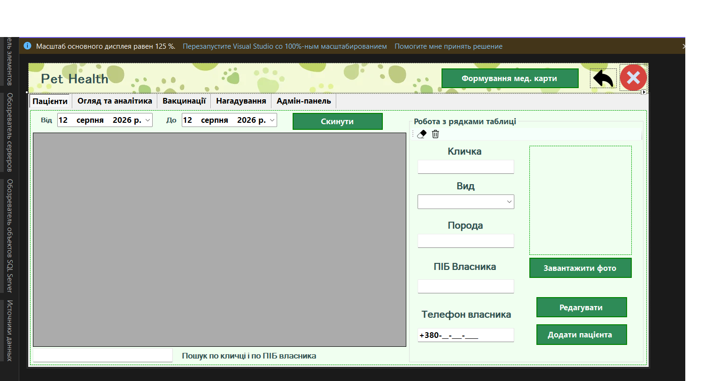
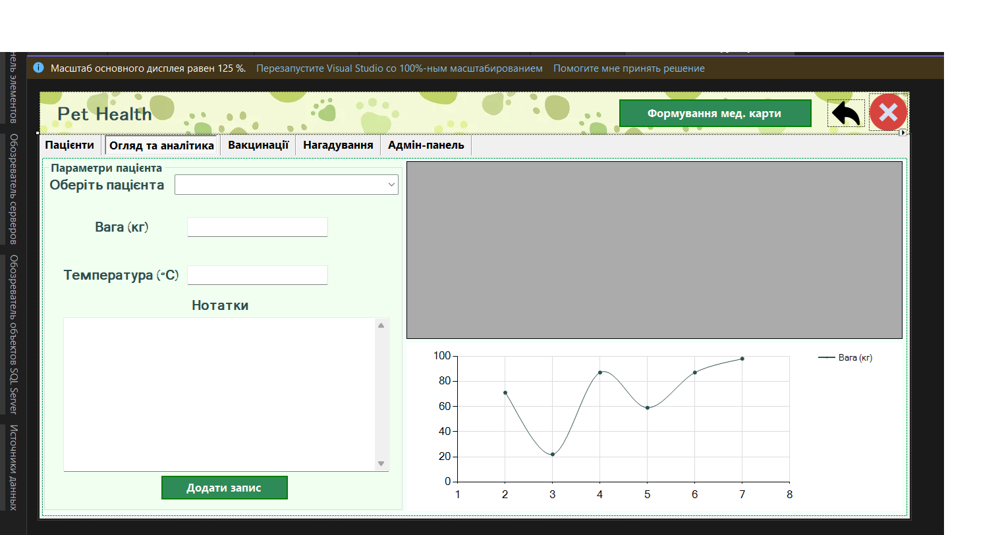
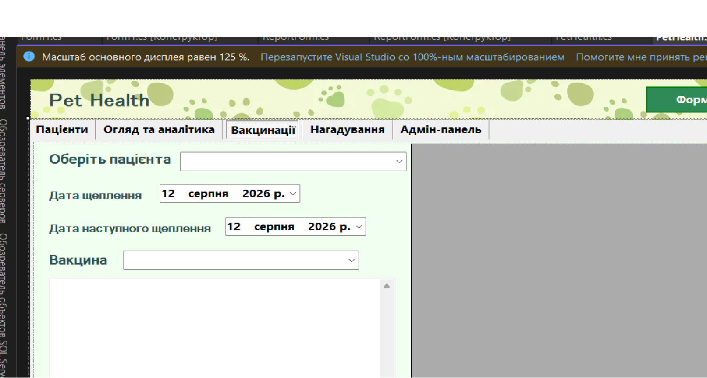
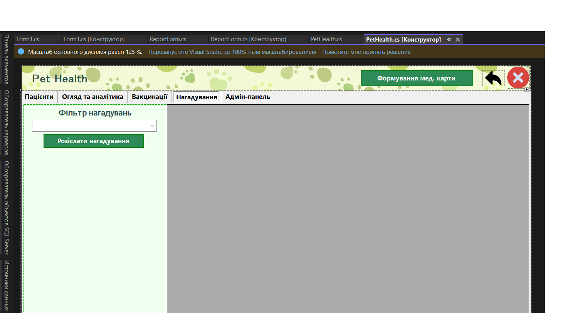
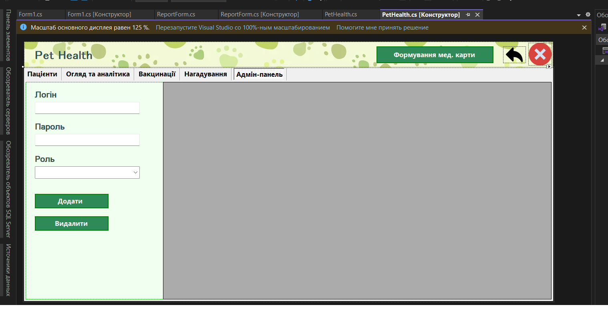
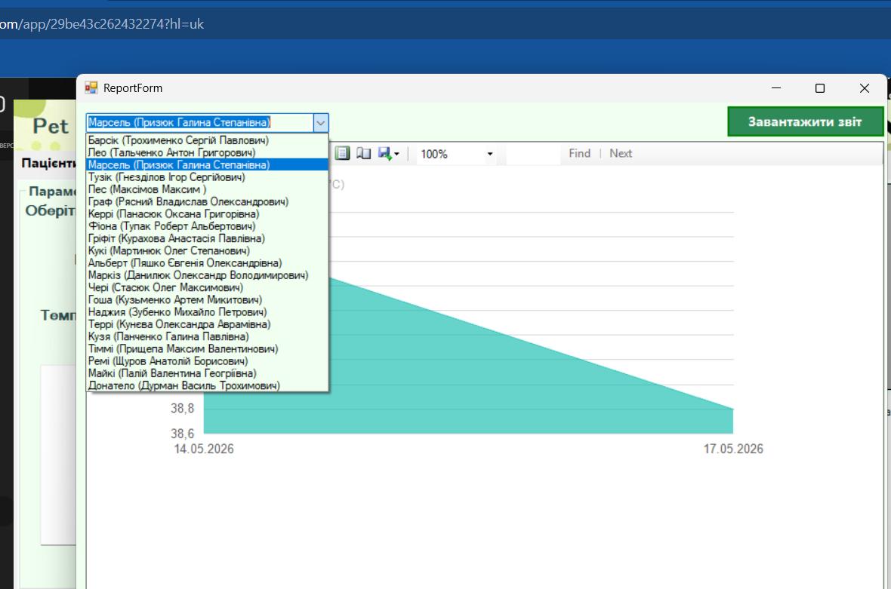
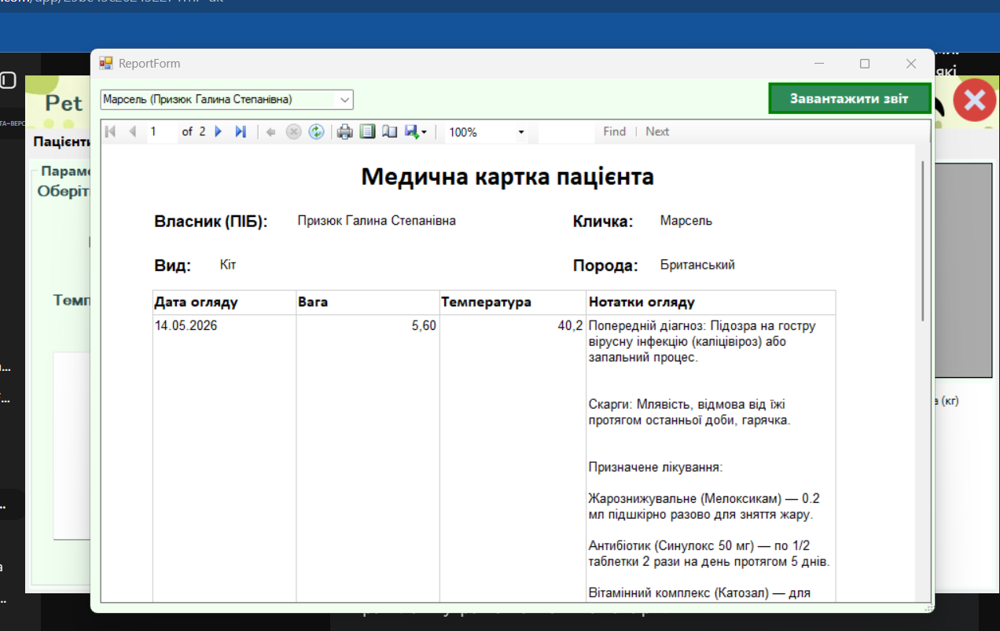
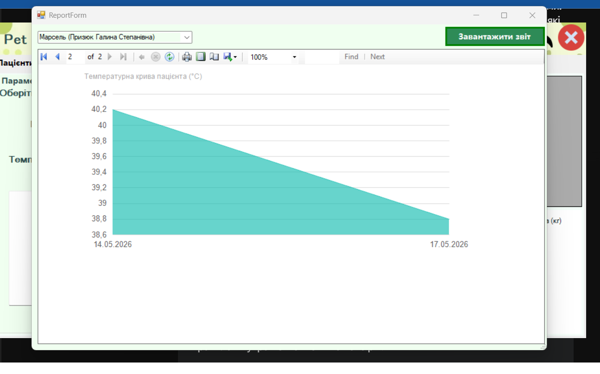
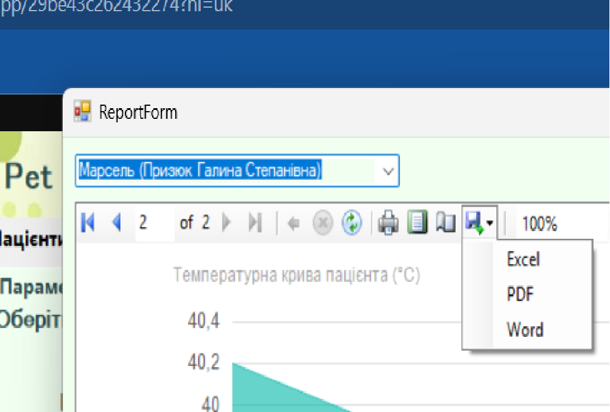

# pet-health-vet-clinic-app
# 🐾 Pet Health — Система управління ветеринарною клінікою

**Pet Health** — це десктопний додаток, покликаний автоматизувати щоденну роботу ветеринарних клінік. Програма забезпечує плавний перехід від паперових медичних карток до надійних електронних записів, що гарантує швидкий пошук інформації та захист даних від втрати чи фізичного пошкодження.

База даних проєкту спроєктована на **MySQL** (із візуальним зв'язуванням таблиць вручну). Важливою перевагою є те, що БД має **портативний характер і повністю вшита у файли програми**. Це дозволяє розгорнути та запустити додаток на будь-якому комп'ютері відразу "з коробки", без необхідності встановлювати та налаштовувати сторонні SQL-сервери.

## 🔐 Трирівнева система доступу
Програма має чіткий розподіл ролей для безпеки та зручності роботи персоналу:
* **Адміністратор (Реєстратура):** Займається первинним записом пацієнтів, вносить дані про тварин та їхніх власників, а також керує розсилкою нагадувань про вакцинацію.
* **Ветеринар:** Проводить огляди, фіксує їхні результати, встановлює діагнози та призначає необхідні вакцинації.
* **Головний лікар:** Має повний адміністративний доступ. Керує профілями працівників (додає, видаляє, змінює ролі). Для захисту системи передбачено автоматичне блокування видалення власного акаунту.

---

## 🛠 Основний функціонал програми

### 1. Вкладка «Пацієнти»
Тут зберігається вся базова інформація. Можна записати кличку тварини, її вид, породу, ПІБ власника та контактний телефон. Є можливість завантажити фото пацієнта та здійснювати швидкий пошук по базі.

### 2. Вкладка «Огляд та аналітика»
Робоче місце ветеринара. Лікар вносить дані про поточний стан тварини: вагу, температуру, результати огляду та встановлений діагноз. Для зручності реалізована візуальна аналітика — графік зміни ваги пацієнта, який автоматично будується на основі всіх попередніх візитів.

### 3. Вкладка «Вакцинації»
Дозволяє чітко планувати щеплення. Лікар обирає конкретну вакцину залежно від виду тварини або встановленого діагнозу, а також фіксує дати поточного та наступного щеплень.

### 4. Вкладка «Нагадування»
Інструмент для зв'язку з клієнтами. Дозволяє формувати списки для розсилки нагадувань власникам про планові вакцинації, які мають відбутися у певний період. *(Примітка: на даному етапі розробки курсового проєкту вкладка працює як заглушка, інтерфейс підготовлено для майбутньої інтеграції з сервісами реальних розсилок).*

### 5. Вкладка «Адмін-панель»
Закрита зона, доступна виключно Головному лікарю. Призначена для управління персоналом клініки: створення нових профілів для лікарів чи адміністраторів та налаштування їхніх прав доступу.

---

## 📄 Формування медичної карти (Експорт звітів)
Однією з ключових функцій є генерація повноцінної медичної карти пацієнта. За допомогою спеціального вікна можна обрати тварину з випадаючого списку та миттєво згенерувати детальний звіт.

Звіт містить зручну зведену таблицю з усіма оглядами, нотатками лікаря та призначеним лікуванням:

Також до карти автоматично додаються аналітичні графіки (наприклад, температурна крива пацієнта, яка допомагає відслідкувати динаміку хвороби):

Готову карту можна легко експортувати у зручному форматі, зокрема в **PDF**, Excel або Word, для друку чи відправки власнику тварини.

